<p align="center">
  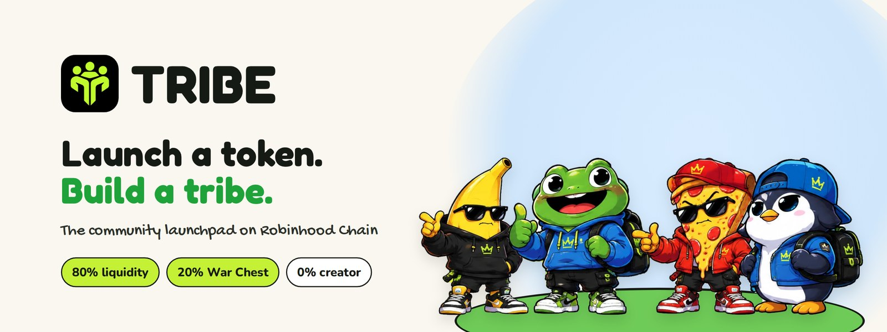
</p>

<p align="center">
  <b>The community launchpad on Robinhood Chain.</b><br>
  Every token is a tribe: a token plus the people who hold it.
</p>

<p align="center">
  <a href="https://gettribe.fun"></a>
  <a href="https://x.com/Gettribedotfun"></a>
  
  
  
</p>

<p align="center">
  <a href="#-features">Features</a> ·
  <a href="#-tokenomics">Tokenomics</a> ·
  <a href="#%EF%B8%8F-tribe-wars">Tribe Wars</a> ·
  <a href="#-real-tribe">Real Tribe</a> ·
  <a href="#-screenshots">Screenshots</a> ·
  <a href="#-architecture">Architecture</a> ·
  <a href="#-getting-started">Getting started</a> ·
  <a href="docs/en.md">Docs</a>
</p>

## 🌱 Why TRIBE

Most launchpads stop at "create a token". TRIBE starts there. It rewards communities that actually show up and makes fake hype expensive.

| | |
| --- | --- |
| 🚫 **No creator allocation** | The creator gets 0% of supply. Nothing to dump on holders. |
| 💧 **Tradable from minute one** | 80% of supply seeds the liquidity pool at launch. |
| 🏆 **Rewards go to holders** | 20% is locked in a War Chest that only pays out to holders of a tribe that wins a Tribe War. |
| 🗳️ **Sybil-resistant voting** | Votes are weighted by tokens held at a hidden snapshot. Splitting a bag across 10,000 wallets adds nothing. |
| 🔍 **Real Tribe transparency** | Same ticker, many tokens? Real Tribe shows which one has the real community, with every number visible. |
| 🎮 **Fun by design** | Mascots, levels, missions, XP and wars turn holding a token into being part of a team. |

## ✨ Features

- **Launch wizard.** 8 steps with a live card preview: name, ticker, mascot (templates or your own image), colors, description and links (X, website, Telegram), supply, review, launch.
- **Tribes.** Each tribe has its own page with level, members, treasury, Tribe Power, activity feed, links and active wars.
- **Market.** Every tribe is listed with price, market cap, liquidity, volume and a chart, plus a buy and sell panel.
- **Tribe Wars.** Tribes challenge each other, holders vote with their tokens and the winner takes the prize. A live carousel on the home page shows the 5 hottest wars.
- **Real Tribe.** A community score and a clean-launch (bundle) score for any token, from any launchpad.
- **Leaderboard and missions.** Tribe Power ranking, XP and missions for your profile.
- **Docs built in.** 16 sections covering every feature, in three languages.
- **Three languages.** English, 中文 and 한국어, switchable anywhere on the site.
- **Sound.** A chiptune soundtrack and click effects made with Web Audio (no audio files), with a mute button.
- **Mobile first.** Every page and every wizard step is tested at phone width.

## 💰 Tokenomics

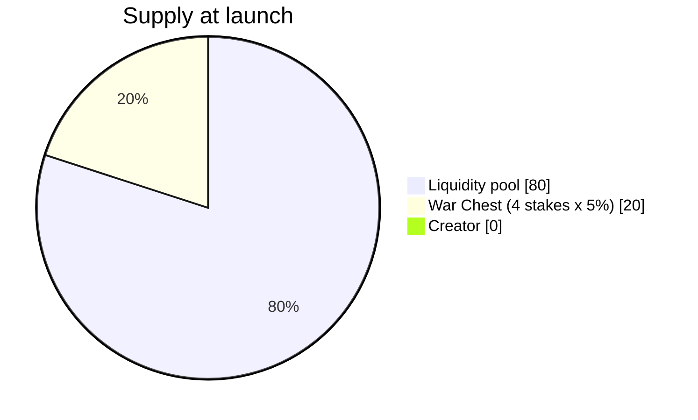

| Allocation | Share | What happens to it |
| --- | --- | --- |
| Liquidity pool | **80%** | Seeds the trading pool so the token is tradable from the first minute. |
| War Chest | **20%** | Locked in the `TribeWars` contract as four 5% stakes. Paid out only to holders of a tribe that wins a Tribe War. |
| Creator | **0%** | The creator gets no allocation. |

Example with a 1B supply: 800M go to the pool and 200M to the War Chest, split into four stakes of 50M, one per war.

## ⚔️ Tribe Wars

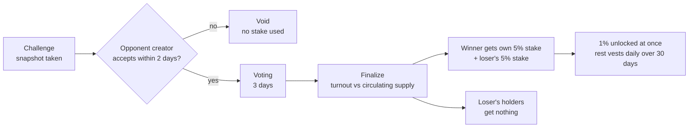

- **Four wars per token.** Each war puts 5% of supply on the line, so the 20% chest covers exactly four wars.
- **Winner takes both stakes.** Holders of the winning tribe share their own stake plus the loser's stake. Holders of the losing tribe get nothing.
- **Fair scoring.** Score = votes ÷ circulating supply. The pool, the chest and the burn address are excluded, so small and large tribes compete on turnout, not size.
- **Token-weighted votes at a snapshot.** The snapshot is taken at the moment of the challenge. Buying or splitting tokens afterwards changes nothing.
- **Vesting.** 1% of the reward unlocks at settlement and the rest unlocks daily over 30 days. Claims never expire.
- **Locked unless won.** If a tribe never fights, its chest stays locked forever. Nobody can withdraw it, including the creator.

## 🔍 Real Tribe

When many tokens share one ticker, Real Tribe shows which one has the real community. It is open to every token from any launchpad and is information only; it is not a requirement for wars.

| Signal | Weight |
| --- | --- |
| Real holders | 30 |
| Spread (top-10 share) | 20 |
| Holding time | 15 |
| Aged wallets | 15 |
| Roll call | 10 |
| Clean launch | 10 |

A separate **bundle score** (0 to 100, where 100 is clean) penalises bundled buys and snipers at launch. A token earns the **REAL TRIBE** badge only with a score of at least 50 and a lead of at least 10 points over the next token with the same ticker; otherwise the ticker is marked **CONTESTED**.

## 📸 Screenshots

<p align="center">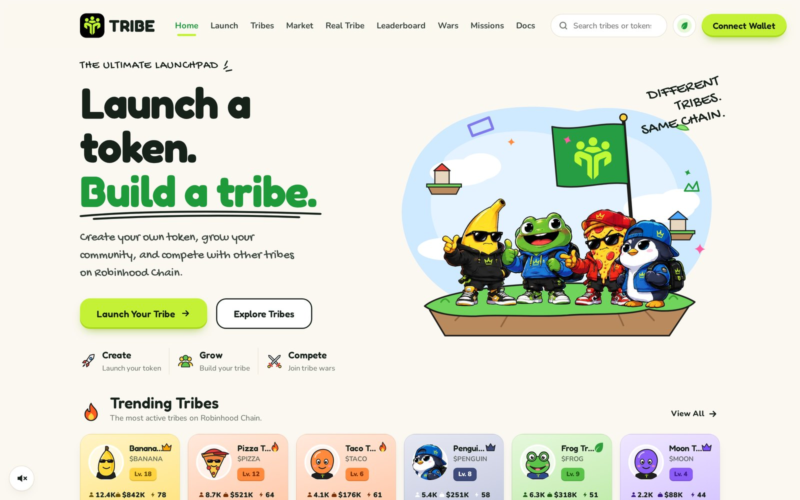</p>

<table>
  <tr>
    <td width="50%">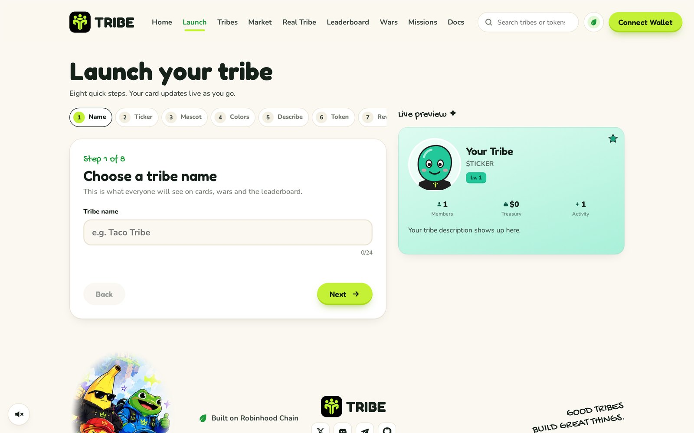<p align="center"><b>Launch wizard</b></p></td>
    <td width="50%">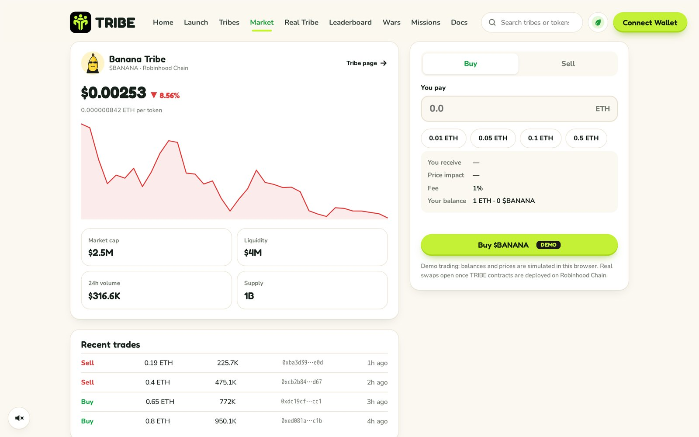<p align="center"><b>Trade</b></p></td>
  </tr>
  <tr>
    <td>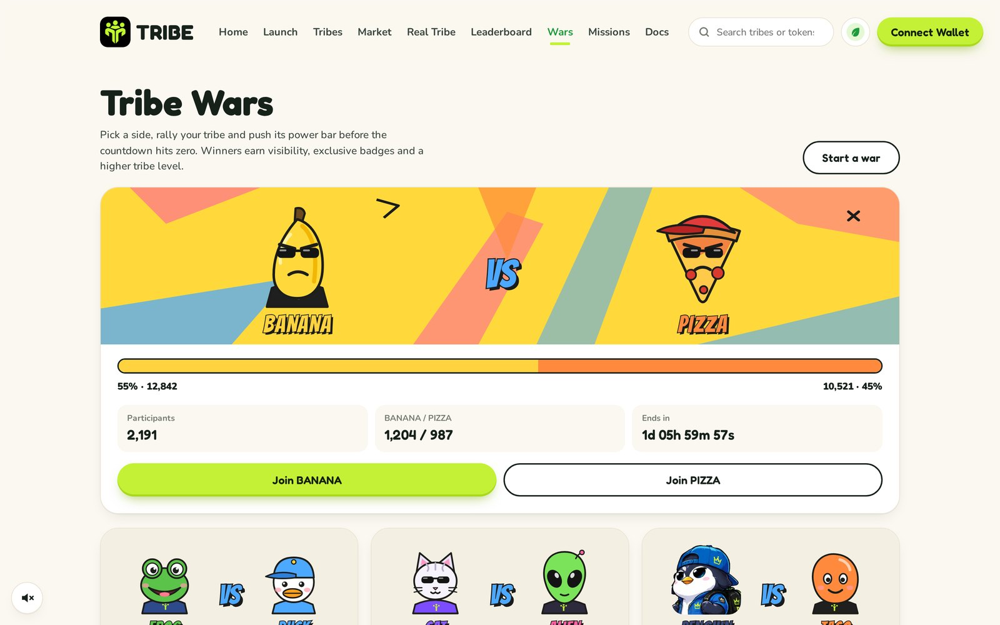<p align="center"><b>Tribe Wars</b></p></td>
    <td>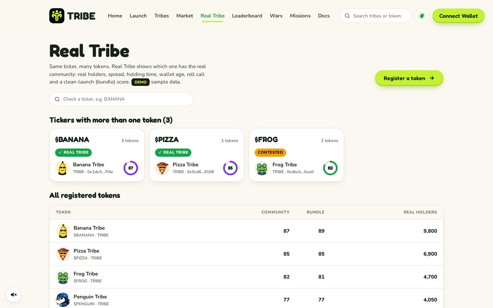<p align="center"><b>Real Tribe</b></p></td>
  </tr>
  <tr>
    <td>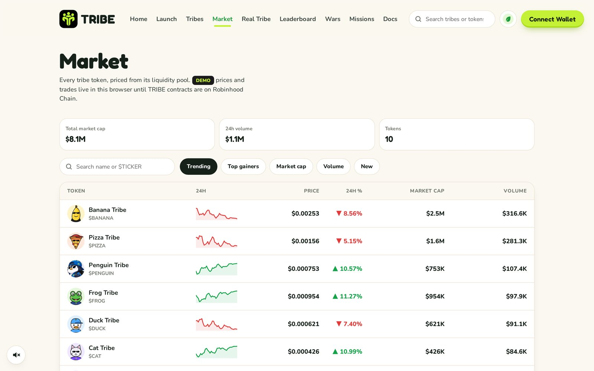<p align="center"><b>Market</b></p></td>
    <td>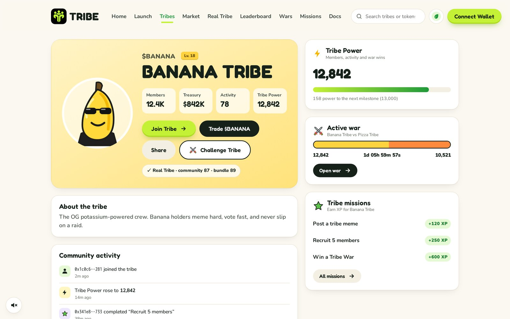<p align="center"><b>Tribe page</b></p></td>
  </tr>
  <tr>
    <td>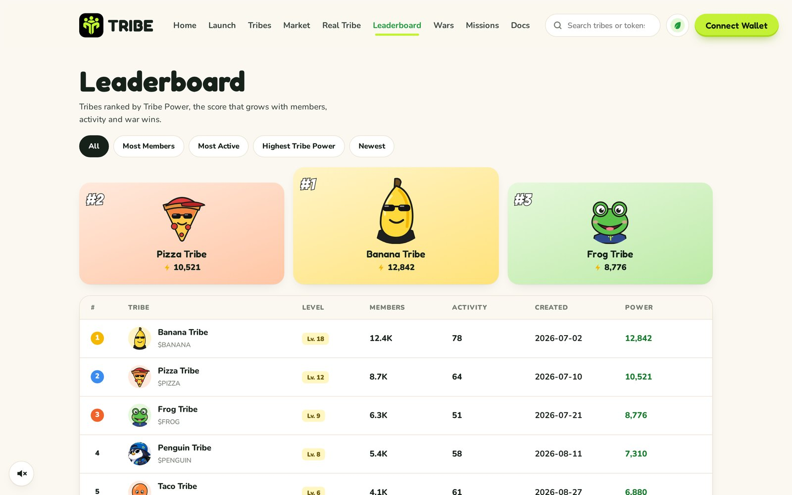<p align="center"><b>Leaderboard</b></p></td>
    <td>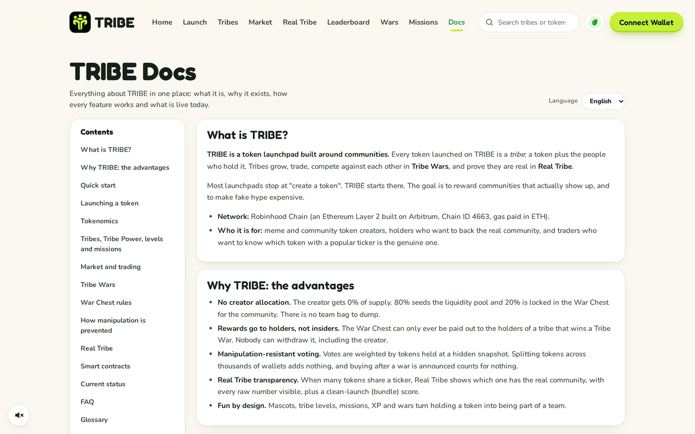<p align="center"><b>Docs</b></p></td>
  </tr>
</table>

<p align="center">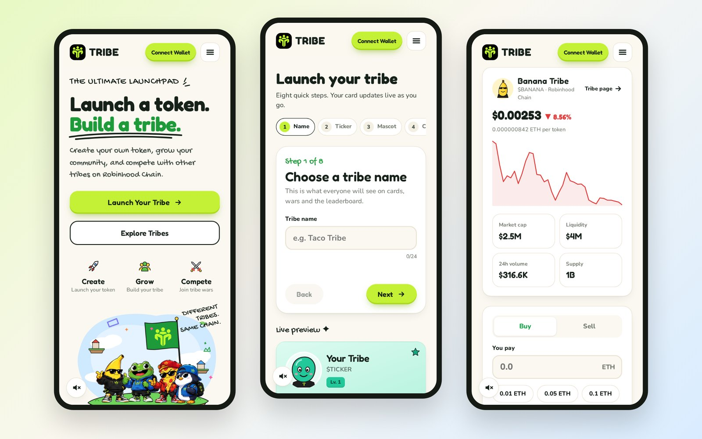<br><b>Built for phones too</b></p>

## 🧱 Architecture

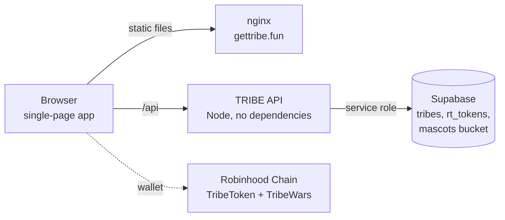

| Layer | Stack |
| --- | --- |
| Website | One HTML file, vanilla JavaScript, hash routing, no build step. Translation layer and docs are plain JS modules. |
| API | Node 18+ with the built-in `http` and `fetch`. Validates every field, rate-limits per IP, and keeps the Supabase service key on the server. |
| Database | Supabase Postgres with row-level security on and no public policies, plus a public storage bucket for mascot images. |
| Contracts | Solidity 0.8.28, OpenZeppelin 5, Hardhat. `TribeToken` is ERC20Votes with delegation disabled and a timestamp clock. |

## 📁 Repository layout

```
tribe/
├── site/            website
│   ├── index.html   the whole app (i18n.js and docs.js are inlined here too)
│   ├── i18n.js      English / 中文 / 한국어 translations
│   ├── docs.js      docs content in three languages
│   └── brand/       logo, favicons, character art
├── api/
│   ├── server.js    TRIBE API
│   ├── schema.sql   Supabase tables
│   └── .env.example
├── contracts/
│   ├── contracts/   TribeToken.sol, TribeWars.sol
│   └── test/        Hardhat tests
└── docs/
    ├── en.md  zh.md  ko.md   full documentation
    └── images/               screenshots
```

## 🚀 Getting started

### Website

```sh
cd site
python3 -m http.server 8080   # or any static server
```

Open http://localhost:8080. Without the API the site still works and keeps data in your browser.

### API

```sh
cd api
cp .env.example .env          # fill in your Supabase URL and service-role key
set -a; . ./.env; set +a
node server.js                # listens on 127.0.0.1:3010
```

Create the tables with `api/schema.sql`, then proxy `/api/` to the server:

```nginx
location /api/ {
    proxy_pass http://127.0.0.1:3010;
    proxy_set_header X-Real-IP $remote_addr;
    client_max_body_size 2m;
}
```

| Method | Path | Purpose |
| --- | --- | --- |
| `GET` | `/api/tribes` | All launched tribes |
| `POST` | `/api/tribes` | Launch a tribe; returns an edit key for the creator |
| `PATCH` | `/api/tribes/:id/links` | Update links (requires `X-Edit-Key`) |
| `GET` | `/api/realtribe` | Registered tokens |
| `POST` | `/api/realtribe` | Register a token |

### Contracts

```sh
cd contracts
npm install
npx hardhat test
```

## 📚 Documentation

The full docs are on the site under **Docs** and in this repository:

- 🇬🇧 [English](docs/en.md)
- 🇨🇳 [中文](docs/zh.md)
- 🇰🇷 [한국어](docs/ko.md)

## 🗺️ Roadmap

- [x] Website with launch wizard, tribes, market, wars, Real Tribe, leaderboard, missions and docs
- [x] English, 中文 and 한국어
- [x] Shared storage for launched tribes and Real Tribe registrations
- [x] `TribeToken` and `TribeWars` contracts with tests
- [ ] External security audit
- [ ] Mainnet deployment on Robinhood Chain
- [ ] Indexer for live prices, holders and war events
- [ ] Real swaps in the trade panel

## ⚠️ Status

The website currently runs in **demo mode**: prices, trades, wars and Real Tribe metrics are simulated. The contracts are tested but **not audited and not deployed**. Nothing on the site sends a blockchain transaction yet.

<p align="center">
  <br>
  <b>Good tribes build great things.</b><br>
  <a href="https://gettribe.fun">gettribe.fun</a> · <a href="https://x.com/Gettribedotfun">@Gettribedotfun</a>
</p>
